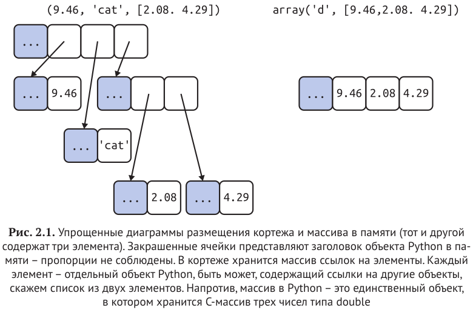
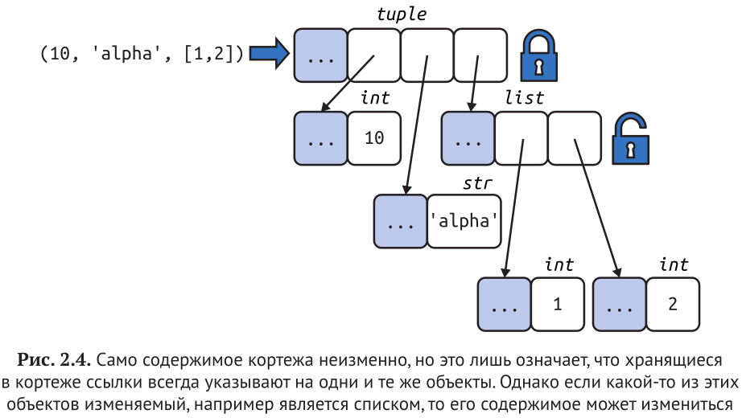
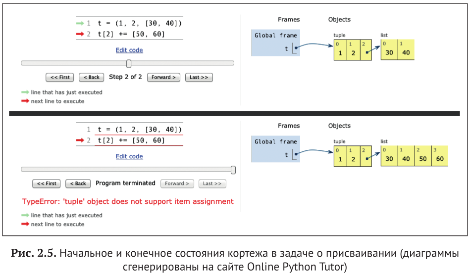

# Глава 2. Массив последовательностей

## Массив последовательностей



## Списковое включение и генераторные выражения

Локальная область видимости внутри включений и генераторных выражений (оператор `:=`)

```python
    >>> x = 'ABC'
    >>>codes = [ord(x) for x in x]
    >>> x
    'ABC'
    >>> codes
    [65, 66, 67]

    >>> x = 'ABC'
    >>> codes = [last := ord(c) for c in x]
    >>> last
    67
    >>> codes
    [65, 66, 67]
    >>> c
    Traceback (most recent call last):
    ile "<stdin>", line 1, in <module>
    NameError: name 'c' is not defined
```

Списковое включение с условием

```python
    >>> symbols = 'ABCDEFGHIGK'
    >>> [ord(s) for s in sympols if ord(s) > 67]
    [68, 69, 70, 71, 72, 73, 71, 75]
```

## Декартовы произведения

Построение декартова произведения с помощью спискового включения

```python
    >>> colors = ['black', 'white']
    >>> sizes = ['S', 'M', 'L']
    >>> tshirts = [(color, size) for color in colors for size in sizes]
    >>> tshirts
    [('black', 'S'), ('black', 'M'), ('black', 'L'), ('white', 'S'), ('white', 'M'), ('white', 'L')]
    >>> tshirts = [(color, size) for size in sizes for color in colors]  # наоборот
    >>> tshirts
    [('black', 'S'), ('white', 'S'), ('black', 'M'), ('white', 'M'), ('black', 'L'), ('white', 'L')]
```

## Генераторные выражения

Инициализацию кортежей, массивов и других последовательностей тоже мож-
но начать с использования спискового включения, но genexp экономит па-
мять, т. к. отдает элементы по одному, применяя протокол итератора, вместо
того чтобы сразу строить целиком список для передачи другому конструктору.

```python
    >>> symbols = '$&@%'
    >>> tuple(ord(symbol) for symbol in symbols)
    (36, 38, 64, 37)
    >>> import array
    >>> array.array('I', (ord(symbol) for symbol in symbols))  # 1 аргумент - тип хранения чисел в массиве
    array('I', [36, 38, 64, 37])
```

Порождение декартова произведения генераторным выражением
Этот список футболок ни в какой момент не находится в памяти: генераторное
выражениеотдает циклу for по одному элементу. Если бы списки, являющиеся
сомножителями декартова произведения, содержали по 1000 элементов, то
применение генераторного выражения позволило бы сэкономить память за счет
отказа от построения спис­ка из миллиона элементов с единственной целью
его обхода в цикле for.

```python
>>> colors = ['black', 'white']
>>> sizes = ['S', 'M', 'L']
>>> for tshirt in (f'{c} {s}' for c in colors for s in sizes):
...     print(tshirt)
... 
black S
black M
black L
white S
white M
white L
```

## Кортежи

Количество элементов часто фиксировано, а порядок всегда важен

```python
    >>> traveler_ids = [('USA', '31195855'), ('BRA', 'CE342567'), 
    ... ('ESP', 'XDA205856')]
    >>> for passport in sorted(traveler_ids):
    ...     print('%s/%s' % passport)
    ...
    BRA/CE342567
    ESP/XDA205856
    USA/31195855
```



```python
    >>> a = (10, 'alpha', [1, 2])
    >>> b = (10, 'alpha', [1, 2])
    >>> a == b
    True
    >>> b[-1].append(99)
    >>> a == b
    False
    >>> b
    (10, 'alpha', [1, 2, 99])
```

## Распаковка последовательностей и итерируемых объектов

```python
    >>> lax_coordinates = (33.9425, -118.408056)
    >>> latitude, longitude = lax_coordinates # распаковка
```

```python
    # обмен значений двух переменных без создания временной переменной
    >>> b, a = a, b
```

```python
    # звездочка перед аргументом при вызове функции
    >>> divmod(20, 8)
    (2, 4)
    >>> t = (20, 8)
    >>> divmod(*t)
    (2, 4)
    >>> quotient, remainder = divmod(*t)
    >>> quotient, remainder
    (2, 4)
```

## Использование * для выборки лишних элементов

```python
    >>> a, b, *rest = range(5)
    >>> a, b, rest
    (0, 1, [2, 3, 4])
    >>> a, b, *rest = range(3)
    >>> a, b, rest
    (0, 1, [2])
    >>> a, b, *rest = range(2)
    >>> a, b, rest
    (0, 1, [])

    # префикс можно ставить в любое место, однако, только единожды
    >>> a, *body, c, d = range(5)
    >>> a, body, c, d
    (0, [1, 2], 3, 4)
    >>> *head, b, c, d = range(5)
    >>> head, b, c, d
    ([0, 1], 2, 3, 4)
```

```python
    # В вызовах функций можно использовать * несколько раз
    >>> def fun(a, b, c, d, *rest):
    ...     return a, b, c, d, rest
    ...
    >>> fun(*[1, 2], 3, *range(4, 7))
    (1, 2, 3, 4, (5, 6))
```

```python
    >>> *range(4), 4
    (0, 1, 2, 3, 4)
    >>> [*range(4), 4]
    [0, 1, 2, 3, 4]
    >>> {*range(4), 4, *(5, 6, 7)}
    {0, 1, 2, 3, 4, 5, 6, 7}
```

## Распаковка вложенных объектов

```python
    metro_areas = [
    ('Tokyo', 'JP', 36.933, (35.689722, 139.691667)),
    ('Delhi NCR', 'IN', 21.935, (28.613889, 77.208889)),
    ('Mexico City', 'MX', 20.142, (19.433333, -99.133333)),
    ('New York-Newark', 'US', 20.104, (40.808611, -74.020386)),
    ('São Paulo', 'BR', 19.649, (-23.547778, -46.635833)),
    ]

    def main():
        print(f'{"":15} | {"latitude":>9} | {"longitude":>9}')  # :>9 - пробелы справа (: или :< - слева)
        for name, _, _, (lat, lon) in metro_areas:
            if lon <= 0:
                print(f'{name:15} | {lat:9.4f} | {lon:9.4f}')

    if __name__ == '__main__':
        main()

                    |  latitude | longitude
    Mexico City     |   19.4333 |  -99.1333
    New York-Newark |   40.8086 |  -74.0204
    São Paulo       |  -23.5478 |  -46.6358

    # 9.4f 
    # 9 - это общая ширина печатаемого поля, заполненного пробелами слева
    # 4 - это количество цифр после десятичной точки
    # f - обозначение с фиксированной точкой
```

## Сопоставление с последовательностями-образцами

Основное улучшение match по сравнению с switch – деструктуризация, т. е. более развитая форма распаковки

```python
    # Чтобы рассмотреть объект как субъект последовательности, 
    # то преобразуйте его тип во фразе match:
    match tuple(phone):
        case ['1', *rest]: # Северная Америка и страны Карибского бассейна
            ...
        case ['2', *rest]: # Африка и некоторые другие территории
            ...
        case ['3' | '4', *rest]: # Европа
            ...
        case _:  # По умолчанию
            ...
```

Любую часть образца можно связать с переменной с помощью ключевого слова as:

```python
    case [name, _, _, (lat, lon) as coord]:
```

В контексте образца эта синтаксическая конструкция производит проверку
типа во время выполнения: образец сопоставится с 4-элементной по-
следовательностью, в которой элемент 0 должен иметь тип str, а элемент 3
должен быть парой чисел типа float:

```python
    case [str(name), _, _, (float(lat), float(lon))]:
```

Если мы хотим произвести сопоставление произвольной последовательности-субъекта,
начинающейся с str и заканчивающейся вложенной последовательностью из двух
float, то можем написать:

```python
    # Здесь *_ сопоставляется с любым числом элементов без привязки их к переменной
    case [str(name), *_, (float(lat), float(lon))]:
```

## Срезы

```python
    # seq[start:stop:step]
    >>> s = 'bicycle'
    >>> s[::3]
    'bye'
    >>> s[::-1]
    'elcycib'
    >>> s[::-2]
    'eccb'
```

```python
    >>> l = list(range(10))
    >>> l
    [0, 1, 2, 3, 4, 5, 6, 7, 8, 9]
    >>> l[2:5] = [20, 30]
    >>> l
    [0, 1, 20, 30, 5, 6, 7, 8, 9]
    >>> del l[5:7]
    >>> l
    [0, 1, 20, 30, 5, 8, 9]
    >>> l[3::2] = [11, 22]
    >>> l
    [0, 1, 20, 11, 5, 22, 9]
    # Когда в левой части присваивания стоит срез, в правой должен 
    # находиться итерируемый объект, даже если он содержит всего один элемент.
    >>> l[2:5] = 100  
    Traceback (most recent call last):
    File "<stdin>", line 1, in <module>
    TypeError: can only assign an iterable
    >>> l[2:5] = [100]
    >>> l
    [0, 1, 100, 22, 9]
```

## Использование + и * для последовательностей

Операторы + и * всегда создают новый объект и никогда не изменяют свои операнды

```python
    >>> l = [1, 2, 3]
    >>> l * 5
    [1, 2, 3, 1, 2, 3, 1, 2, 3, 1, 2, 3, 1, 2, 3]
    >>> 5 * 'abcd'
    'abcdabcdabcdabcdabcd'
```

### Построение списка списков

Верный способ:

```python
    # Список, содержащий три списка длины 3, может представлять поле 
    # для игры в крестики и нолики
    >>> board = [['_'] * 3 for i in range(3)]
    >>> board
    [['_', '_', '_'], ['_', '_', '_'], ['_', '_', '_']]
    >>> board[1][2] = 'X'
    >>> board
    [['_', '_', '_'], ['_', '_', 'X'], ['_', '_', '_']]
```

Короткий, но неверный способ:

```python
    # Список, содержащий три ссылки на один и тот же список, бесполезен
    >>> weird_board = [['_'] * 3] * 3
    >>> weird_board
    [['_', '_', '_'], ['_', '_', '_'], ['_', '_', '_']]
    >>> weird_board[1][2] = 'O'
    >>> weird_board
    [['_', '_', 'O'], ['_', '_', 'O'], ['_', '_', 'O']]
```

## Составное присваивание последовательностей

```python
    >>> l = [1, 2, 3]
    >>> id(l)
    4311953800  # идентификатор исходного списка
    >>> l *= 2
    >>> l
    [1, 2, 3, 1, 2, 3]
    >>> id(l)
    4311953800  # не изменился
    >>> t = (1, 2, 3)
    >>> id(t)
    4312681568  # идентификатор исходного кортежа
    >>> t *= 2
    >>> id(t)
    4301348296  # новый кортеж
```

## Головоломка: присваивание A +=

```python
    >>> t = (1, 2, [30, 40])
    >>> t[2] += [50, 60]
    Traceback (most recent call last):
    File "<stdin>", line 1, in <module>
    TypeError: 'tuple' object does not support item assignment
    >>> t
    (1, 2, [30, 40, 50, 60])
```



## Метод list.sort и встроенная функция sorted

```python
    >>> fruits = ['grape', 'raspberry', 'apple', 'banana']
    >>> sorted(fruits)
    ['apple', 'banana', 'grape', 'raspberry']
    >>> fruits  
    ['grape', 'raspberry', 'apple', 'banana']  # не изменился
    >>> sorted(fruits, reverse=True)
    ['raspberry', 'grape', 'banana', 'apple']
    >>> sorted(fruits, key=len)
    ['grape', 'apple', 'banana', 'raspberry']  # grape 1, т.к. стоял раньше
    >>> sorted(fruits, key=len, reverse=True)
    ['raspberry', 'banana', 'grape', 'apple']  # не инвертированный предыдущий, судя по grape
    >>> fruits
    ['grape', 'raspberry', 'apple', 'banana']  # не изменился
    >>> fruits.sort()
    >>> fruits
    ['apple', 'banana', 'grape', 'raspberry']
```

## Когда список не подходит

### Массивы

Если список содержит только числа, то тип array.array эффективнее, чем list: он
поддерживает все операции над изменяемыми последовательностями (вклю-
чая .pop, .insert и .extend), а также дополнительные методы для быстрой загруз-
ки и сохранения, например .frombytes и .tofile.

```python
    >>> from array import array
    >>> from random import random
    >>> floats = array('d', (random() for i in range(10**7)))  # 'd' - тип двойной точности
    >>> floats[-1]
    0.07802343889111107
    >>> fp = open('floats.bin', 'wb')
    >>> floats.tofile(fp)  # сохранить массив в двоичном файле
    >>> fp.close()
    >>> floats2 = array('d')  # создать пустой массив чисел с плавающей точкой двойной точности
    >>> fp = open('floats.bin', 'rb')
    >>> floats2.fromfile(fp, 10**7)  # прочитать 10 миллионов чисел из двоичного файла
    >>> fp.close()
    >>> floats2[-1]
    0.07802343889111107
    >>> floats2 == floats  # проверить, что содержимое обоих массивов совпадает
    True
```

## Представления областей памяти

Демонстрация силы memoryview

```python
    >>> from array import array
    >>> octets = array('B', range(6))  # Построить массив из шести байт (код типа 'B')
    >>> m1 = memoryview(octets)  # Построить по этому массиву memoryview
    >>> m1.tolist()
    [0, 1, 2, 3, 4, 5]
    >>> m2 = m1.cast('B', [2, 3])  # Построить новое memoryview по предыдущему, но с 2 строками и 3 столбцами
    >>> m2.tolist()
    [[0, 1, 2], [3, 4, 5]]
    >>> m3 = m1.cast('B', [3, 2])  # Еще одно memoryview, на этот раз с 3 строками и 2 столбцами
    >>> m3.tolist()
    [[0, 1], [2, 3], [4, 5]]
    >>> m2[1,1] = 22  # Перезаписать байт в строке 1, столбце 1 представления m2 значением 22
    >>> m3[1,1] = 33  # Перезаписать байт в строке 1, столбце 1 представления m3 значением 33
    >>> octets  # Отобразить исходный массив
    array('B', [0, 1, 2, 33, 22, 51])  # octets, m1, m2 и m3 использовали одну и ту же память
```

Сила во вред

```python
>>> numbers = array.array('h', [-2, -1, 0, 1, 2])
>>> memv = memoryview(numbers)  # memoryview типа short signed (код типа 'h')
>>> len(memv)
5
>>> memv[0]  # memv видит те же самые 5 элементов массива
-2
>>> memv_oct = memv.cast('B')  # Создать объект memv_oct, приведя элементы memv к коду типа ‘B’ (unsigned char)
>>> memv_oct.tolist()  # Экспортировать элементы memv_oct в виде списка для инспекции
[254, 255, 255, 255, 0, 0, 1, 0, 2, 0]
>>> memv_oct[5] = 4  # Присвоить значение 4 байту со смещением 5
>>> numbers
array('h', [-2, -1, 1024, 1, 2])  # двухбайтовое число, в котором старший байт равен 4, равно 1024
```

## NumPy

```python
    >>> import numpy as np
    >>> a = np.arange(12)  # массив numpy.ndarray, содержащий целые числа от 0 до 11
    >>> a
    array([ 0, 1, 2, 3, 4, 5, 6, 7, 8, 9, 10, 11])
    >>> type(a)
    <class 'numpy.ndarray'>
    >>> a.shape  # одномерный массив с 12 элементами
    (12,)
    >>> a.shape = 3, 4  # Изменить форму массива, добавив еще одно измерение (3 х 4)
    >>> a
    array([[ 0, 1, 2, 3],
           [ 4, 5, 6, 7],
           [ 8, 9, 10, 11]])
    >>> a[2]  # Получить строку с индексом 2
    array([ 8, 9, 10, 11])
    >>> a[2, 1]  # Получить элемент с индексами 2, 1
    9
    >>> a[:, 1]  # Получить столбец с индексом 1
    array([1, 5, 9])
    >>> a.transpose()  # Создать новый массив, транспонировав* исходный
    array([[ 0, 4, 8],
           [ 1, 5, 9],
           [ 2, 6, 10],
           [ 3, 7, 11]])

    # *Транспонировать - переставить местами строки и столбцы 
```

```python
    >>> import numpy
    >>> floats = numpy.loadtxt('floats-10M-lines.txt')  # 10 миллионов чисел с плавающей точкой из текстового файла
    >>> floats[-3:]  # последние три числа
    array([ 3016362.69195522, 535281.10514262, 4566560.44373946])
    >>> floats *= .5  # Умножить каждый элемент массива floats на 0.5
    >>> floats[-3:]
    array([ 1508181.34597761, 267640.55257131, 2283280.22186973])
    >>> from time import perf_counter as pc  # таймер высокого разрешения
    >>> t0 = pc(); floats /= 3; pc() - t0  # для 10 миллионов чисел с плавающей точкой это заняло менее 40 миллисекунд
    0.03690556302899495
    >>> numpy.save('floats-10M', floats)  # Сохранить массив в двоичном файле с расширением .npy
    # Загрузить данные в виде спроецированного на память файла в другой массив; 
    # это позволяет эффективно обрабатывать срезы массива, хотя он и не находится целиком в памяти:
    >>> floats2 = numpy.load('floats-10M.npy', 'r+')  
    >>> floats2 *= 6  # умножить все на 6
    >>> floats2[-3:]  # распечатать последние три
    memmap([ 3016362.69195522, 535281.10514262, 4566560.44373946])
```

## Двусторонние и другие очереди

Класс collections.deque – это потокобезопасная двусторонняя очередь, пред-
назначенная для быстрой вставки и удаления из любого конца. Эта структу-
ра удобна и для хранения списка «последних виденных элементов» и прочего
в том же духе, т. к. deque можно сделать ограниченной (при создании задать
максимальную длину)

```python
    >>> from collections import deque
    >>> dq = deque(range(10), maxlen=10)
    >>> dq
    deque([0, 1, 2, 3, 4, 5, 6, 7, 8, 9], maxlen=10)
    >>> dq.rotate(3) 
    # В результате циклического сдвига с n > 0 элементы удаляются с правого конца и
    # добавляются с левого; при n < 0 удаление производится с левого конца, а добавление – с правого
    >>> dq
    deque([7, 8, 9, 0, 1, 2, 3, 4, 5, 6], maxlen=10)
    >>> dq.rotate(-4)
    >>> dq
    deque([1, 2, 3, 4, 5, 6, 7, 8, 9, 0], maxlen=10)
    >>> dq.appendleft(-1)
    # При добавлении элемента в заполненную очередь (len(d) == d.maxlen) происходит
    # удаление с другого конца; обратите внимание, что в следующей строке элемент 0 отсутствует
    >>> dq
    deque([-1, 1, 2, 3, 4, 5, 6, 7, 8, 9], maxlen=10)
    >>> dq.extend([11, 22, 33])
    # При добавлении трех элементов справа удаляются три элемента слева: –1, 1 и 2
    >>> dq
    deque([3, 4, 5, 6, 7, 8, 9, 11, 22, 33], maxlen=10)
    >>> dq.extendleft([10, 20, 30, 40])
    # Отметим, что функция extendleft(iter) добавляет последовательные элементы из
    # объекта iter в левый конец очереди, т. е. в итоге элементы будут размещены в
    # порядке, противоположном исходному
    >>> dq
    deque([40, 30, 20, 10, 3, 4, 5, 6, 7, 8], maxlen=10)
```

## Поговорим

Аргумент `key` также позволяет сортировать списки, содержащие числа и похожие на числа строки.
Нужно только решить, как интерпретировать все объекты: как целые числа или как строки:

```python
    >>> l = [28, 14, '28', 5, '9', '1', 0, 6, '23', 19]
    >>> sorted(l, key=int)
    [0, '1', 5, 6, '9', 14, 19, '23', 28, '28']
    >>> sorted(l, key=str)
    [0, '1', 14, 19, '23', 28, '28', 5, 6, '9']
```
